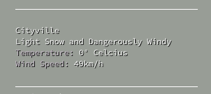

# conky-darksky


_A simple python script that integrates the DarkSky Weather API with Conky_

# Requirements
- Python 3
- `requests`
- `python-decouple`
- Free API key from https://darksky.net

# Installation
Installation is the same as your run of the mill python script:

```
git clone https://github.com/ranguli/conky-darksky
cd ./conky-darksky
pip install -r requirements.txt
```
I almost always use a virtualenv, but it just felt kind of overkill for this.
There's no reason you couldn't though.

# Configuration 
### env
- Create a `.env` file based on the provided `env.dist` example. Add your API
  key from https://darksky.net. It should look like this: 

```
DARK_SKY_API_KEY=yourrealapikeyhere
```

### conky.rc 
```
# Ensure that your `.conkyrc` is set to run the script periodically (every 300 seconds):
${execi 300 python ~/yourpath/conky-darksky/conky-darksky.py} 

# Display a line of output, N, from .conky-darksky
${exec cat ~/your/path/conky-darksky/.conky-darksky | sed -n {N}p} 

```

The free version of the Dark Sky API allows 1,000 requests/day. At 300 seconds, you would make 288 requests/day. If you cared enough, you could update as frequently as `90` seconds with a few left over for breathing room. But weather doesn't change that fast and is a waste 🤔


### output:
Almost everything returned in a DarkSky API call is stored line by line in `.conky-darksky`:

```
Light Snow and Windy        # Line 0: Summary of weather condition
snow                        # Line 1: Appropriate type of icon to use (i.e Font Awesome) 
0                           # Line 2: Temperature in Celcius
31                          # Line 3: Temperature in Fahrenheit
37                          # Line 4: Wind in miles/hour
23                          # Line 5: Wind in km/h

```
Simply `sed` for the line of output you want in your `.conkyrc` file as shown
above.

## Usage:
Run the script once on its own, and then add your changes to your `.conkyrc`
before reloading conky.
